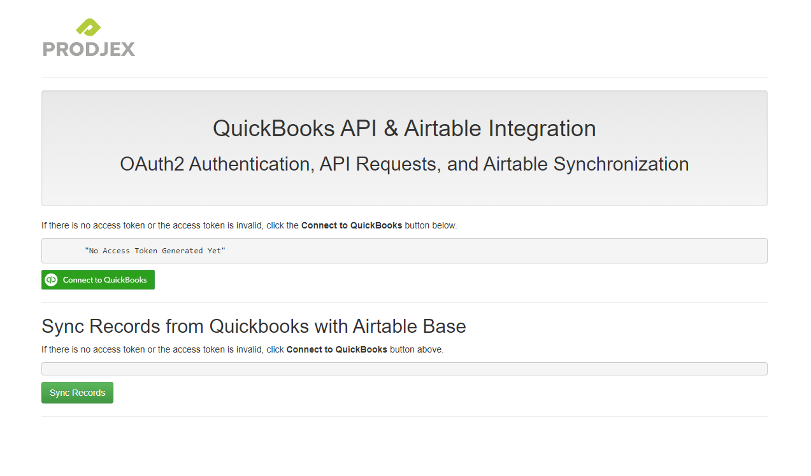

QuickBooks and Airtable Integration App
==========================================================

## Overview

This app is designed to connect with QuickBooks Online to fetch estimates and update records in Airtable using Airtable's API. The app demonstrates how to authorize using OAuth2.0 with QuickBooks and then interact with both QuickBooks and Airtable through API calls.

## Features

This sample app is meant to showcase an example of how to integrate your app with the Intuit Developer Platform. It showcases the following:

* OAuth2.0 Authorization with QuickBooks: Securely authorize the app to access QuickBooks data.
* Fetch Estimates from QuickBooks: Retrieve estimates from your QuickBooks account.
* Update Airtable Records: Use the retrieved estimates to update corresponding records in an Airtable base.


## Installation

### Clone the Repository

```bash
$ git clone https://github.com/ZainIshtiaqAhmadDev/quickbooks-airtable-integration.git
$ cd quickBooks-airtable-integration
$ curl -sS https://getcomposer.org/installer | php
$ composer install
```

## Pre-requisites

* [Intuit Developer Account and App Setup](https://developer.intuit.com/app/developer/qbo/docs/get-started) :  
You need an Intuit Developer account and an app set up. Follow the Get Started guide for details.

* [Airtable Account and API Key](https://airtable.com/api/docs) :  
Set up an Airtable account and generate an API key from your Airtable account settings.

* [Client Keys](https://developer.intuit.com/app/developer/qbo/docs/get-started/get-client-id-and-client-secret) :  
Obtain OAuth 2.0 client keys from your QuickBooks app dashboard on the Intuit Developer portal.

* [Redirect URI](https://developer.intuit.com/app/developer/qbo/docs/get-started) :  
Define a redirect URI in your app settings on the Intuit Developer portal.


## Configuration

Edit the config.php file to include your credentials:


* **QuickBooks Client ID** and **Client Secret**: Obtain these from the Intuit Developer portal.
* **Airtable API Key**: Generate this from your Airtable account. 
* **Redirect URI**: Define this URI in your Intuit Developer app settings and ensure it matches your configuration (e.g: `http://localhost:3000/callback.php`).
* **Airtable Base ID** and **Table ID**: Identify these from your Airtable base settings

### TLS / SSL (**optional**)

To expose your local development environment to the internet, you can use ngrok: 

Here are the steps to configure ngrok  
* Download and install ngrok.
* Run ngrok http 3000 in your terminal.
* Use the forwarding URL provided by ngrok as your redirect URI.


## Usage

*Start the local PHP server:*
```bash
$ php -S localhost:3000
```

*If using ngrok, start it as well:*
```bash
$ ngrok http 3000
```

* Access the app via the provided URL (e.g., https://755c8b38.ngrok.io/).
* You will be redirected to the Intuit authorization page. After authorization, you will be redirected back to home page with token details printed.
* Click the "Login (OAuth2.0)" button to authorize the app and click on sync estimates button to fetch estimates from quickbooks and update in airtable.



